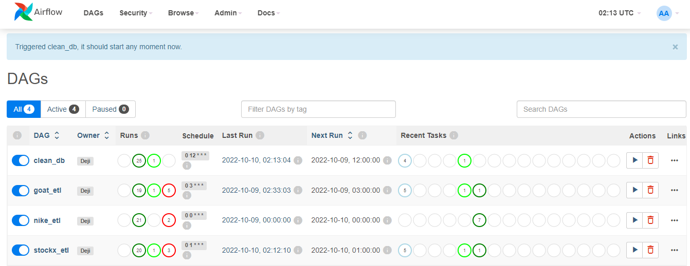

# Airflow-ETL
        
   


Running ETL workflow in Apache Airflow


## Docker commands

### Initialize airflow instance
```bash
docker-compose up airflow-init
```
```bash
docker-compose up 
```
### check if containers are up and running
```bash
docker ps
```
### shut down services
```bash
docker-compose down
```
### execute bash commands in container
```bash
docker exec -it <container name> bash
```
### extending  docker image
<!-- ```bash
docker-compose up -d --no-deps --build airflow-webserver airflow-scheduler
``` -->
```bash
docker build . --tag extending_airflow:latest
```
Change image name from apache-airflow IN `docker-compose.yaml` file.
```bash
image: ${AIRFLOW_IMAGE_NAME:-extending_airflow:latest}
```
```bash
docker-compose up -d --no-deps --build airflow-webserver airflow-scheduler
```